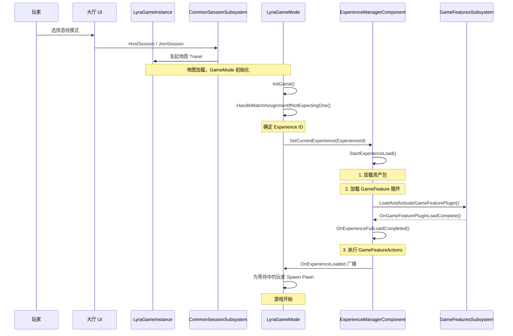
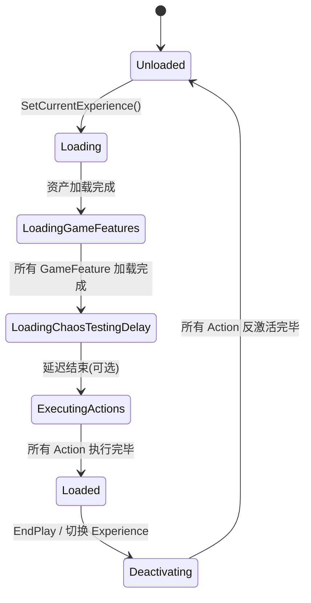
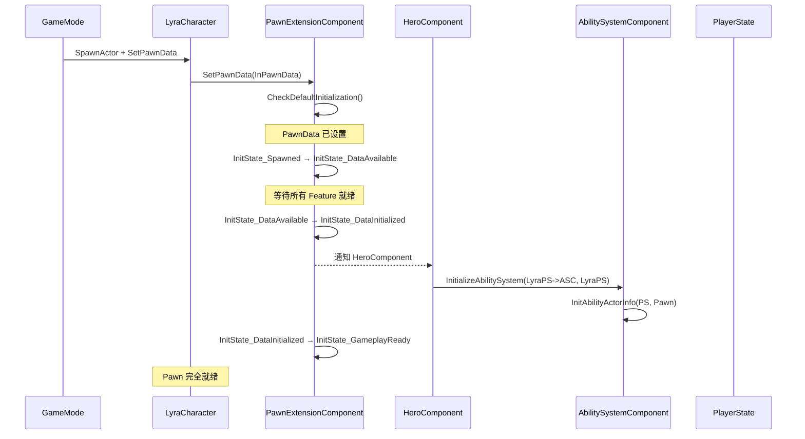
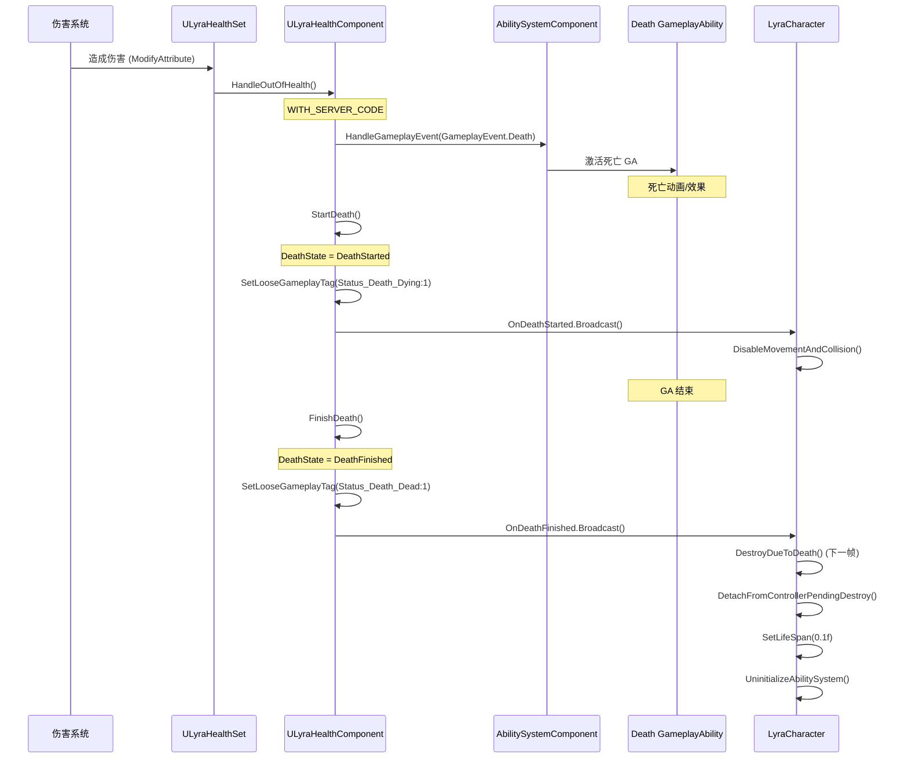
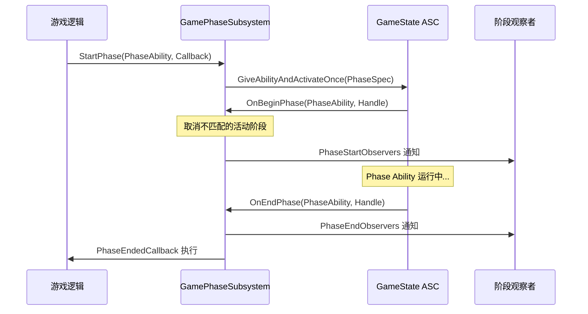
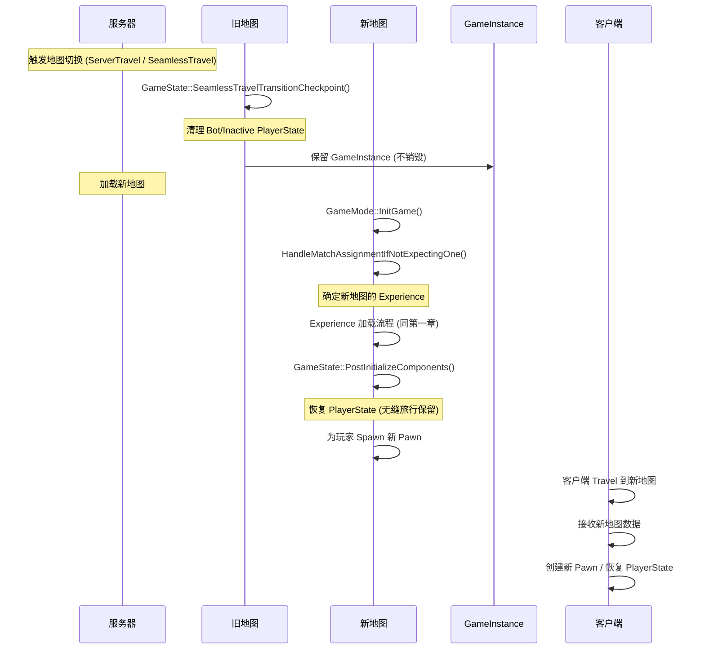

---
tags:
  - Lyra
  - GameFlow
  - UE5
date: 2026-06-16
---

# Lyra 游戏流程分析

> 本文档分析 Lyra 项目中从游戏大厅选择游戏模式到进入游戏、游戏开始到角色死亡、游戏开始到一局游戏结束、游戏中切换地图的完整流程。

## 核心类层次结构

```
UGameInstance
  └─ UCommonGameInstance         (CommonGame Plugin)
       └─ ULyraGameInstance       (LyraGame)

AGameModeBase
  └─ AModularGameModeBase        (ModularGameplayActors Plugin)
       └─ ALyraGameMode           (LyraGame)

AGameStateBase
  └─ AModularGameStateBase       (ModularGameplayActors Plugin)
       └─ ALyraGameState          (LyraGame)

APlayerController
  └─ ACommonPlayerController     (CommonGame Plugin)
       └─ ALyraPlayerController  (LyraGame)

APlayerState
  └─ AModularPlayerState         (ModularGameplayActors Plugin)
       └─ ALyraPlayerState        (LyraGame)

APawn
  └─ AModularPawn                (ModularGameplayActors Plugin)
       └─ ALyraPawn               (LyraGame)

ACharacter
  └─ AModularCharacter           (ModularGameplayActors Plugin)
       └─ ALyraCharacter          (LyraGame)

UAbilitySystemComponent
  └─ ULyraAbilitySystemComponent (LyraGame)
```

## 关键子系统

| 子系统 | 类型 | 职责 |
|--------|------|------|
| `UCommonUserSubsystem` | GameInstance | 用户登录、权限管理 |
| `UCommonSessionSubsystem` | GameInstance | 会话创建/加入/销毁 |
| `UGameUIManagerSubsystem` | GameInstance | UI 布局管理 |
| `ULyraGamePhaseSubsystem` | World | 游戏阶段管理 |
| `UGameFrameworkComponentManager` | GameInstance | Actor 扩展/组件请求管理 |
| `UGameFeaturesSubsystem` | Engine | GameFeature 插件加载/卸载 |

---

# 一、从大厅选择模式到进入游戏

## 1.1 总体时序



## 1.2 详细步骤

### 1.2.1 GameInstance 初始化

`UCommonGameInstance::Init()` (CommonGameInstance.cpp:82-104) 负责：

1. 从 `ICommonUIModule` 获取平台特征标签 (Platform Trait Tags)
2. 绑定 `UCommonUserSubsystem` 的回调：
   - `OnHandleSystemMessage` → 系统消息处理
   - `OnUserPrivilegeChanged` → 权限变更处理
   - `OnUserInitializeComplete` → 用户初始化完成
3. 绑定 `UCommonSessionSubsystem` 的回调：
   - `OnUserRequestedSessionEvent` → 外部请求加入会话（如平台邀请）
   - `OnDestroySessionRequestedEvent` → OSS 请求销毁会话

```cpp
// CommonGameInstance.cpp:82-104
void UCommonGameInstance::Init()
{
    Super::Init();
    // 获取平台特征
    FGameplayTagContainer PlatformTraits = ICommonUIModule::GetSettings().GetPlatformTraits();
    // 绑定用户子系统回调
    UserSubsystem->SetTraitTags(PlatformTraits);
    UserSubsystem->OnHandleSystemMessage.AddDynamic(this, &UCommonGameInstance::HandleSystemMessage);
    UserSubsystem->OnUserPrivilegeChanged.AddDynamic(this, &UCommonGameInstance::HandlePrivilegeChanged);
    UserSubsystem->OnUserInitializeComplete.AddDynamic(this, &UCommonGameInstance::HandlerUserInitialized);
    // 绑定会话子系统回调
    SessionSubsystem->OnUserRequestedSessionEvent.AddUObject(this, &UCommonGameInstance::OnUserRequestedSession);
    SessionSubsystem->OnDestroySessionRequestedEvent.AddUObject(this, &UCommonGameInstance::OnDestroySessionRequested);
}
```

### 1.2.2 用户请求加入会话

当玩家从大厅选择游戏模式时，`UCommonSessionSubsystem` 触发 `OnUserRequestedSessionEvent`：

- `UCommonGameInstance::OnUserRequestedSession()` → `SetRequestedSession()`
- 如果 `CanJoinRequestedSession()` 返回 true（Lyra 默认始终允许），直接调用 `JoinRequestedSession()`
- `JoinRequestedSession()` 调用 `SessionSubsystem->JoinSession()` 进行地图 Travel

```cpp
// CommonGameInstance.cpp:150-163
void UCommonGameInstance::SetRequestedSession(UCommonSession_SearchResult* InRequestedSession)
{
    RequestedSession = InRequestedSession;
    if (RequestedSession) {
        if (CanJoinRequestedSession())
            JoinRequestedSession();    // 可以直接加入
        else
            ResetGameAndJoinRequestedSession();  // 需要先重置状态
    }
}
```

### 1.2.3 GameMode::InitGame 与 Experience 确定

地图加载完成后，`ALyraGameMode::InitGame()` (LyraGameMode.cpp:80-86) 被调用：

```cpp
void ALyraGameMode::InitGame(const FString& MapName, const FString& Options, FString& ErrorMessage)
{
    Super::InitGame(MapName, Options, ErrorMessage);
    // 下一帧再处理，给启动设置初始化时间
    GetWorld()->GetTimerManager().SetTimerForNextTick(
        this, &ThisClass::HandleMatchAssignmentIfNotExpectingOne);
}
```

`HandleMatchAssignmentIfNotExpectingOne()` (LyraGameMode.cpp:88-165) 按优先级确定 Experience：

| 优先级 | 来源 | 说明 |
|--------|------|------|
| 1 (最高) | Matchmaking 分配 | 通过在线匹配系统指定 |
| 2 | URL Options | `?Experience=XXX` 参数 |
| 3 | Developer Settings | PIE 下的覆盖设置 |
| 4 | Command Line | `-Experience=XXX` 命令行参数 |
| 5 | World Settings | 地图的 `ALyraWorldSettings` 中配置 |
| 6 | Dedicated Server | DS 模式下使用 DefaultExperience |
| 7 (最低) | 默认值 | 硬编码的 `B_LyraDefaultExperience` |

**Dedicated Server 特殊处理** (LyraGameMode.cpp:167-191)：如果当前地图是默认地图且为 DS 模式，调用 `TryDedicatedServerLogin()`：
- 通过 `CommonUserSubsystem::TryToLoginForOnlinePlay()` 做在线登录
- 登录完成后回调 `OnUserInitializedForDedicatedServer()`
- 然后调用 `HostDedicatedServerMatch()` 创建在线服务器

### 1.2.4 Experience 加载流程

`OnMatchAssignmentGiven()` (LyraGameMode.cpp:289-303) 将 ExperienceId 传递给 `ULyraExperienceManagerComponent`：

```cpp
void ALyraGameMode::OnMatchAssignmentGiven(FPrimaryAssetId ExperienceId, const FString& ExperienceIdSource)
{
    ULyraExperienceManagerComponent* ExperienceComponent = 
        GameState->FindComponentByClass<ULyraExperienceManagerComponent>();
    ExperienceComponent->SetCurrentExperience(ExperienceId);
}
```

`ULyraExperienceManagerComponent` 是 Experience 加载的核心，定义于 LyraExperienceManagerComponent.h。其状态机如下：



`StartExperienceLoad()` (LyraExperienceManagerComponent.cpp:123-212) 执行的步骤：

1. **加载资产包**：通过 `ULyraAssetManager` 加载 Experience 和 ActionSet 的 `Equipped` Bundle
2. **区分 Client/Server**：根据 NetMode 决定加载 Client 或 Server Bundle
3. **异步等待**：资产加载完成后回调 `OnExperienceLoadComplete()`

`OnExperienceLoadComplete()` (LyraExperienceManagerComponent.cpp:214-276) 执行的步骤：

1. 收集所有需要加载的 GameFeature 插件 URL（从 Experience 和 ActionSet 的 `GameFeaturesToEnable` 列表）
2. 调用 `UGameFeaturesSubsystem::LoadAndActivateGameFeaturePlugin()` 逐个加载
3. 每个插件加载完成后回调 `OnGameFeaturePluginLoadComplete()`
4. 所有插件加载完成后调用 `OnExperienceFullLoadCompleted()`

`OnExperienceFullLoadCompleted()` (LyraExperienceManagerComponent.cpp:289-359) 执行的步骤：

1. **可选延迟**：通过 CVar `lyra.chaos.ExperienceDelayLoad` 插入测试延迟
2. **执行 GameFeatureAction**：按顺序对每个 Action 调用：
   - `OnGameFeatureRegistering()` — 注册阶段（如注册 InputMappingContext）
   - `OnGameFeatureLoading()` — 加载阶段
   - `OnGameFeatureActivating(Context)` — 激活阶段（关联到当前 World）
3. **广播完成**：按优先级顺序广播委托：
   - `OnExperienceLoaded_HighPriority` — 高优先级（系统级初始化）
   - `OnExperienceLoaded` — 常规优先级（GameMode 在此生成玩家）
   - `OnExperienceLoaded_LowPriority` — 低优先级（UI 等）

### 1.2.5 GameFeatureAction 执行

GameFeatureAction 是 Experience 可扩展性的核心。`ULyraExperienceDefinition` 中可以配置 `Actions` 和 `ActionSets`。

**Lyra 中的关键 GameFeatureAction**：

| Action | 作用 | 关键文件 |
|--------|------|----------|
| `GameFeatureAction_AddAbilities` | 为 Actor 添加 GA/AttributeSet/AbilitySet | GameFeatureAction_AddAbilities.cpp |
| `GameFeatureAction_AddInputContextMapping` | 添加输入映射上下文 | GameFeatureAction_AddInputContextMapping.cpp |
| `GameFeatureAction_AddInputBinding` | 添加输入绑定 | GameFeatureAction_AddInputBinding.cpp |
| `GameFeatureAction_AddWidget` | 添加 UI Widget | GameFeatureAction_AddWidget.cpp |
| `GameFeatureAction_AddGameplayCuePath` | 添加 GameplayCue 路径 | GameFeatureAction_AddGameplayCuePath.cpp |
| `GameFeatureAction_SplitscreenConfig` | 分屏配置 | GameFeatureAction_SplitscreenConfig.cpp |

**AddAbilities 的工作原理** (GameFeatureAction_AddAbilities.cpp:104-129)：

1. `AddToWorld()` 通过 `UGameFrameworkComponentManager::AddExtensionHandler()` 注册扩展处理器
2. 当匹配的 Actor 类被创建时，回调 `HandleActorExtension()`
3. 在 `NAME_ExtensionAdded` 或 `NAME_LyraAbilityReady` 事件时，调用 `AddActorAbilities()`
4. `AddActorAbilities()` 在 Actor 上查找或创建 ASC，然后授予 GA/AttributeSet/AbilitySet

**AddInputContextMapping 的工作原理** (GameFeatureAction_AddInputContextMapping.cpp:63-72)：

1. `OnGameFeatureRegistering()` 时注册 IMC 到 EnhancedInput 设置系统
2. 同时监听 `FWorldDelegates::OnStartGameInstance` 为已存在的 GameInstance 注册
3. `AddToWorld()` 时通过 `UGameFrameworkComponentManager` 注册 APlayerController 扩展

### 1.2.6 玩家加入与 Spawn

`ALyraGameMode::InitGameState()` (LyraGameMode.cpp:452-460) 注册了 Experience 加载完成回调：

```cpp
void ALyraGameMode::InitGameState()
{
    Super::InitGameState();
    ULyraExperienceManagerComponent* ExperienceComponent = 
        GameState->FindComponentByClass<ULyraExperienceManagerComponent>();
    ExperienceComponent->CallOrRegister_OnExperienceLoaded(
        FOnLyraExperienceLoaded::FDelegate::CreateUObject(this, &ThisClass::OnExperienceLoaded));
}
```

`OnExperienceLoaded()` (LyraGameMode.cpp:305-321)：遍历所有已登录但还没有 Pawn 的 PlayerController，调用 `RestartPlayer()`：

```cpp
void ALyraGameMode::OnExperienceLoaded(const ULyraExperienceDefinition* CurrentExperience)
{
    for (FConstPlayerControllerIterator Iterator = GetWorld()->GetPlayerControllerIterator(); Iterator; ++Iterator)
    {
        APlayerController* PC = Cast<APlayerController>(*Iterator);
        if ((PC != nullptr) && (PC->GetPawn() == nullptr))
        {
            if (PlayerCanRestart(PC))
                RestartPlayer(PC);
        }
    }
}
```

**HandleStartingNewPlayer** (LyraGameMode.cpp:391-398)：会阻塞新玩家的初始化直到 Experience 加载完成：

```cpp
void ALyraGameMode::HandleStartingNewPlayer_Implementation(APlayerController* NewPlayer)
{
    if (IsExperienceLoaded())
        Super::HandleStartingNewPlayer_Implementation(NewPlayer);
    // 否则等待 OnExperienceLoaded 来处理
}
```

**Pawn Spawn 流程** (LyraGameMode.cpp:345-383)：

```cpp
APawn* ALyraGameMode::SpawnDefaultPawnAtTransform_Implementation(AController* NewPlayer, const FTransform& SpawnTransform)
{
    // 1. 获取 PawnClass（从 PawnData 中获取）
    UClass* PawnClass = GetDefaultPawnClassForController(NewPlayer);
    // 2. 以延迟构造方式 Spawn
    APawn* SpawnedPawn = GetWorld()->SpawnActor<APawn>(PawnClass, SpawnTransform, SpawnInfo);
    // 3. 设置 PawnData 到 PawnExtensionComponent
    if (ULyraPawnExtensionComponent* PawnExtComp = ULyraPawnExtensionComponent::FindPawnExtensionComponent(SpawnedPawn))
    {
        PawnExtComp->SetPawnData(PawnData);  // 触发初始化链
    }
    // 4. 完成 Spawn
    SpawnedPawn->FinishSpawning(SpawnTransform);
}
```

**ChoosePlayerStart** (LyraGameMode.cpp:401-409)：委托给 `ULyraPlayerSpawningManagerComponent`，由每个 Experience 自定义生成位置。

---

# 二、游戏开始到角色死亡

## 2.1 Pawn 初始化状态机 (InitState)

Lyra 使用 `UGameFrameworkComponentManager` 和 `IGameFrameworkInitStateInterface` 实现组件化初始化。

**InitState 状态链**：

```
InitState_Spawned → InitState_DataAvailable → InitState_DataInitialized → InitState_GameplayReady
```

### 2.1.1 ULyraPawnExtensionComponent 初始化

`ULyraPawnExtensionComponent` 是 Pawn 初始化的核心协调者，定义于 LyraPawnExtensionComponent.h。



**OnRegister** (LyraPawnExtensionComponent.cpp:41-53)：
- 确保 Component 只能附加到 Pawn
- 确保每个 Pawn 只有一个 PawnExtensionComponent
- 通过 `RegisterInitStateFeature()` 注册到 `UGameFrameworkComponentManager`

**BeginPlay** (LyraPawnExtensionComponent.cpp:56-66)：
- 监听所有 Feature 的 InitState 变化
- 尝试转换到 `InitState_Spawned`
- 调用 `CheckDefaultInitialization()` 尝试继续推进

**状态转换条件** (LyraPawnExtensionComponent.cpp:224-269)：
- `Spawned → DataAvailable`：需要 PawnData 已设置，且（在 Authority 或 Local 端）已被 Controller 控制
- `DataAvailable → DataInitialized`：所有 Feature 都达到 DataAvailable
- `DataInitialized → GameplayReady`：直接允许

### 2.1.2 ULyraHeroComponent 初始化

`ULyraHeroComponent` 是玩家角色特有的组件，负责输入绑定和相机设置，定义于 LyraHeroComponent.h。

**状态转换条件** (LyraHeroComponent.cpp:76-143)：
- `Spawned → DataAvailable`：需要有 `ALyraPlayerState`，以及 Controller/InputComponent（非 SimulatedProxy 时）
- `DataAvailable → DataInitialized`：需要 PlayerState 存在且 PawnExtensionComponent 达到 DataInitialized
- `DataInitialized → GameplayReady`：直接允许

**HandleChangeInitState (DataAvailable → DataInitialized)** (LyraHeroComponent.cpp:145-183)：
1. 调用 `PawnExtComp->InitializeAbilitySystem(LyraPS->GetLyraAbilitySystemComponent(), LyraPS)`
2. 调用 `InitializePlayerInput()` 设置输入绑定
3. 设置相机模式确定回调

### 2.1.3 ASC 初始化

`ULyraPawnExtensionComponent::InitializeAbilitySystem()` (LyraPawnExtensionComponent.cpp:105-150)：

```cpp
void ULyraPawnExtensionComponent::InitializeAbilitySystem(ULyraAbilitySystemComponent* InASC, AActor* InOwnerActor)
{
    // 1. 如果已有不同的 ASC 在使用，先反初始化（处理客户端滞后场景）
    if (AbilitySystemComponent && AbilitySystemComponent != InASC)
        UninitializeAbilitySystem();
    
    // 2. 如果有旧的 Avatar Actor，先踢出
    if (ExistingAvatar != nullptr && ExistingAvatar != Pawn)
        OtherExtensionComponent->UninitializeAbilitySystem();
    
    // 3. 设置 ASC 的 ActorInfo
    AbilitySystemComponent = InASC;
    AbilitySystemComponent->InitAbilityActorInfo(InOwnerActor, Pawn);
    
    // 4. 设置 TagRelationshipMapping（从 PawnData）
    InASC->SetTagRelationshipMapping(PawnData->TagRelationshipMapping);
    
    // 5. 广播初始化完成
    OnAbilitySystemInitialized.Broadcast();
}
```

**OnAbilitySystemInitialized 回调链** (LyraCharacter.cpp:197-205)：
```cpp
void ALyraCharacter::OnAbilitySystemInitialized()
{
    ULyraAbilitySystemComponent* LyraASC = GetLyraAbilitySystemComponent();
    HealthComponent->InitializeWithAbilitySystem(LyraASC);  // 初始化健康组件
    InitializeGameplayTags();                               // 初始化运动模式标签
}
```

## 2.2 ASC 架构

Lyra 采用 **ASC 放在 PlayerState** 上、**Pawn 作为 Avatar** 的架构：

```
PlayerState (Owner) ─── ASC ─── Pawn (Avatar)
     │                            │
     ├─ HealthSet                ├─ PawnExtensionComponent
     ├─ CombatSet                ├─ HealthComponent
     └─ AbilitySets              ├─ HeroComponent
                                  └─ CameraComponent
```

**初始化时序**：
1. `ALyraPlayerState` 构造时创建 `ULyraAbilitySystemComponent` (LyraPlayerState.cpp:34-36)
2. `ALyraPlayerState::PostInitializeComponents()` 调用 `ASC->InitAbilityActorInfo(this, GetPawn())` (LyraPlayerState.cpp:167-183)
3. Experience 加载完成后，`OnExperienceLoaded()` 调用 `SetPawnData()` 授予 AbilitySets (LyraPlayerState.cpp:185-213)
4. Pawn Spawn 后，`LyraHeroComponent` 调用 `PawnExtComp->InitializeAbilitySystem(LyraPS->ASC, LyraPS)` 建立 Avatar 关系

## 2.3 死亡流程

Lyra 的死亡系统通过 **Health + GameplayEvent + GA** 的方式实现。



### 2.3.1 HandleOutOfHealth

当 `ULyraHealthSet::GetHealth()` 降到 ≤0 时，触发 `OnOutOfHealth` 委托。

`ULyraHealthComponent::HandleOutOfHealth()` (LyraHealthComponent.cpp:148-188)：

1. **发送 GameplayEvent.Death**：通过 ASC 的 `HandleGameplayEvent` 发送 `LyraGameplayTags::GameplayEvent_Death` 事件，激活配置了该 Trigger 的死亡 GA
2. **广播 Elimination 消息**：通过 `UGameplayMessageSubsystem` 广播 `TAG_Lyra_Elimination_Message` 消息，供其他系统（如计分板）监听

### 2.3.2 StartDeath

`ULyraHealthComponent::StartDeath()` (LyraHealthComponent.cpp:235-255)：
1. 设置 `DeathState = ELyraDeathState::DeathStarted`
2. 添加 GameplayTag `Status_Death_Dying`（计数 1）
3. 广播 `OnDeathStarted`

### 2.3.3 LyraCharacter 响应死亡

`ALyraCharacter` 在构造函数中绑定了死亡回调 (LyraCharacter.cpp:68-70)：
```cpp
HealthComponent->OnDeathStarted.AddDynamic(this, &ThisClass::OnDeathStarted);
HealthComponent->OnDeathFinished.AddDynamic(this, &ThisClass::OnDeathFinished);
```

**OnDeathStarted** (LyraCharacter.cpp:339-342)：调用 `DisableMovementAndCollision()` — 禁用输入、碰撞和移动

**OnDeathFinished** (LyraCharacter.cpp:344-347)：下一帧调用 `DestroyDueToDeath()`

### 2.3.4 FinishDeath 与销毁

`ULyraHealthComponent::FinishDeath()` (LyraHealthComponent.cpp:257-277)：
1. 设置 `DeathState = ELyraDeathState::DeathFinished`
2. 添加 GameplayTag `Status_Death_Dead`
3. 广播 `OnDeathFinished`

`ALyraCharacter::DestroyDueToDeath()` (LyraCharacter.cpp:367-372) → `UninitAndDestroy()` (LyraCharacter.cpp:375-393)：
1. 调用 `K2_OnDeathFinished()`（蓝图事件）
2. `DetachFromControllerPendingDestroy()` — 解除 Controller 绑定
3. `SetLifeSpan(0.1f)` — 延迟销毁
4. `PawnExtComponent->UninitializeAbilitySystem()` — 清理 ASC（取消非 SurvivesDeath 标签的 Ability，移除 GameplayCue）

### 2.3.5 网络死亡状态同步

`ELyraDeathState` 通过 `OnRep_DeathState` 在客户端同步 (LyraHealthComponent.cpp:190-233)：
- 收到 `DeathStarted` 时调用 `StartDeath()`
- 收到 `DeathFinished` 时先 `StartDeath()` 再 `FinishDeath()`
- 处理滞后预测：如果客户端已经预测到了更后面的状态，忽略服务器回退

---

# 三、游戏开始到一局游戏结束

## 3.1 游戏阶段系统 (GamePhaseSystem)

Lyra 使用 `ULyraGamePhaseSubsystem` (World Subsystem) 管理游戏阶段。每个阶段都是一个 **GameplayAbility**，运行在 **GameState 的 ASC** 上。



### 3.1.1 ULyraGamePhaseSubsystem

定义于 LyraGamePhaseSubsystem.cpp。

**StartPhase** (LyraGamePhaseSubsystem.cpp:50-70)：
1. 在 GameState 的 ASC 上 `GiveAbilityAndActivateOnce` 指定的 Phase Ability
2. 如果激活成功，记录 PhaseEndedCallback

**OnBeginPhase** (LyraGamePhaseSubsystem.cpp:136-191)：
1. 遍历所有当前活跃的 Phase
2. 如果新 Phase 的 Tag 不匹配已有 Phase 的 Tag，取消已有 Phase
3. 这允许 Phase 的层级嵌套（如 `Game.Playing.SuddenDeath` 不会取消 `Game.Playing`）
4. 通知所有 `PhaseStartObservers`

**OnEndPhase** (LyraGamePhaseSubsystem.cpp:193-211)：
1. 执行该 Phase 的 `PhaseEndedCallback`
2. 从 `ActivePhaseMap` 移除
3. 通知所有 `PhaseEndObservers`

### 3.1.2 ULyraGamePhaseAbility

定义于 LyraGamePhaseAbility.cpp。

- 配置为 `ServerInitiated`/`ServerOnly`/`ReplicateNo`/`InstancedPerActor`
- `ActivateAbility` 时调用 `PhaseSubsystem->OnBeginPhase()`
- `EndAbility` 时调用 `PhaseSubsystem->OnEndPhase()`
- 关联一个 `GamePhaseTag`（如 `Game.Warmup`、`Game.Playing`、`Game.PostGame`）

### 3.1.3 典型的游戏阶段流程

```
Game.Warmup
  └─→ Game.Playing
        ├─→ Game.Playing.SuddenDeath (子阶段，Game.Playing 保持活跃)
        └─→ Game.Over
              └─→ Game.PostGame / 返回大厅
```

## 3.2 一局游戏结束

游戏结束通常由以下方式触发：
- 某个 Phase Ability 的内部逻辑判定条件满足，结束自己并开始 `Game.Over` 阶段
- 或者通过 `UGameplayMessageSubsystem` 广播消息，由监听者触发阶段转换

Experience 结束时 (`EndPlay`)：
- `ULyraExperienceManagerComponent::EndPlay()` 反激活所有 GameFeatureAction
- 所有 `GameFeaturePluginURLs` 中的插件被 `DeactivateGameFeaturePlugin()`

---

# 四、游戏中切换地图

## 4.1 Seamless Travel 流程

Lyra 在 `ALyraGameState::SeamlessTravelTransitionCheckpoint()` (LyraGameState.cpp:72-83) 中处理无缝旅行：

```cpp
void ALyraGameState::SeamlessTravelTransitionCheckpoint(bool bToTransitionMap)
{
    // 移除不活跃的玩家和 Bot
    for (int32 i = PlayerArray.Num() - 1; i >= 0; i--)
    {
        APlayerState* PlayerState = PlayerArray[i];
        if (PlayerState && (PlayerState->IsABot() || PlayerState->IsInactive()))
        {
            RemovePlayerState(PlayerState);
        }
    }
}
```

## 4.2 地图切换的完整流程



## 4.3 关键点

1. **PlayerState 持久化**：Seamless Travel 时 PlayerState 会被保留，跨地图携带数据
2. **新 Experience**：新地图可以有不同的 Experience（通过 WorldSettings 或 URL Options 指定）
3. **GameFeature 切换**：换地图时旧 Experience 反激活，新 Experience 激活，GameFeature 插件随之切换
4. **GenericPlayerInitialization** (LyraGameMode.cpp:462-467)：每次玩家在新地图初始化后都会广播 `OnGameModePlayerInitialized` 委托

---

# 五、关键概念总结

## 5.1 Modular Gameplay Actors

ModularGameplayActors 插件提供了 Component-based 的 Gameplay Framework：

| 基类 | 替代 UE 默认 | 特点 |
|------|-------------|------|
| `AModularGameModeBase` | `AGameModeBase` | 配合 ModularGameStateBase |
| `AModularGameMode` | `AGameMode` | 配合 ModularGameState |
| `AModularGameStateBase` | `AGameStateBase` | 支持 Component |
| `AModularGameState` | `AGameState` | 支持 Component |
| `AModularPlayerController` | `APlayerController` | 支持 Component |
| `AModularPlayerState` | `APlayerState` | 支持 Component |
| `AModularPawn` | `APawn` | 支持 Component |
| `AModularCharacter` | `ACharacter` | 支持 Component |

## 5.2 GameFrameworkComponentManager

- GameInstance 级子系统
- 管理 **Component 请求** (`AddComponentRequest`)：为特定 Actor 类自动添加 Component
- 管理 **扩展处理器** (`AddExtensionHandler`)：当 Actor 创建/销毁时触发回调
- 管理 **InitState 系统**：通过 GameplayTag 驱动的状态机协调 Component 初始化

## 5.3 GameFeature 插件系统

- GameFeature 是动态加载/卸载的 UE 插件
- 由 `UGameFeaturesSubsystem` 管理
- 每个 GameFeature 包含多个 `UGameFeatureAction`
- 在 Experience 加载时激活，切换 Experience 时反激活
- 通过 `UGameFrameworkComponentManager` 与游戏代码解耦

## 5.4 Experience 系统

- `ULyraExperienceDefinition` 是 DataAsset，定义游戏体验
- 包含：GameFeatures 列表、DefaultPawnData、Actions
- 确定优先级：Matchmaking > URL > DevSettings > CommandLine > WorldSettings > Default
- 加载由 `ULyraExperienceManagerComponent` 管理（GameState Component）
- 加载阶段：资产加载 → GameFeature 加载 → Action 执行 → 广播完成

## 5.5 ASC 与 Pawn 的关系

- **ASC Owner**: `ALyraPlayerState`（持久化，跨 Pawn 生命周期）
- **ASC Avatar**: Pawn（随死亡/重生而更换）
- **GameState ASC**: 用于全局效果（如 GameplayCue、GamePhaseAbility）
- **PawnData 驱动**: Pawn 的能力通过 `ULyraPawnData` 上的 `AbilitySets` 授予

## 5.6 文件索引

| 文件 | 路径 |
|------|------|
| LyraGameInstance | LyraGameInstance.h |
| CommonGameInstance | CommonGameInstance.h |
| LyraGameMode | LyraGameMode.h / LyraGameMode.cpp |
| LyraGameState | LyraGameState.h / LyraGameState.cpp |
| LyraPlayerController | LyraPlayerController.h |
| LyraPlayerState | LyraPlayerState.h / LyraPlayerState.cpp |
| LyraCharacter | LyraCharacter.h / LyraCharacter.cpp |
| LyraPawn | LyraPawn.h |
| LyraPawnExtensionComponent | LyraPawnExtensionComponent.h / LyraPawnExtensionComponent.cpp |
| LyraHeroComponent | LyraHeroComponent.h / LyraHeroComponent.cpp |
| LyraHealthComponent | LyraHealthComponent.h / LyraHealthComponent.cpp |
| LyraAbilitySystemComponent | LyraAbilitySystemComponent.h |
| LyraExperienceDefinition | LyraExperienceDefinition.h |
| LyraExperienceManagerComponent | LyraExperienceManagerComponent.h / LyraExperienceManagerComponent.cpp |
| LyraGamePhaseSubsystem | LyraGamePhaseSubsystem.cpp |
| LyraGamePhaseAbility | LyraGamePhaseAbility.cpp |
| LyraGameFeaturePolicy | LyraGameFeaturePolicy.h |
| GameFeatureAction_AddAbilities | GameFeatureAction_AddAbilities.cpp |
| GameFeatureAction_AddInputContextMapping | GameFeatureAction_AddInputContextMapping.cpp |
| LyraPlayerSpawningManagerComponent | LyraPlayerSpawningManagerComponent.h |
| LyraGameplayTags | LyraGameplayTags.h |
