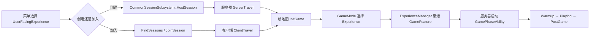
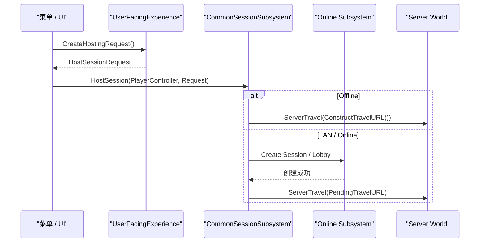
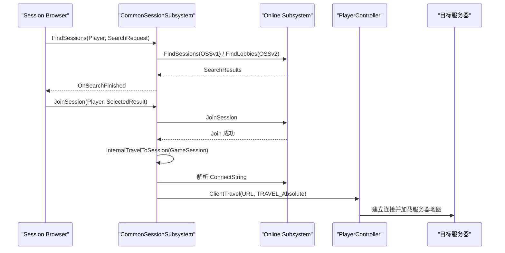
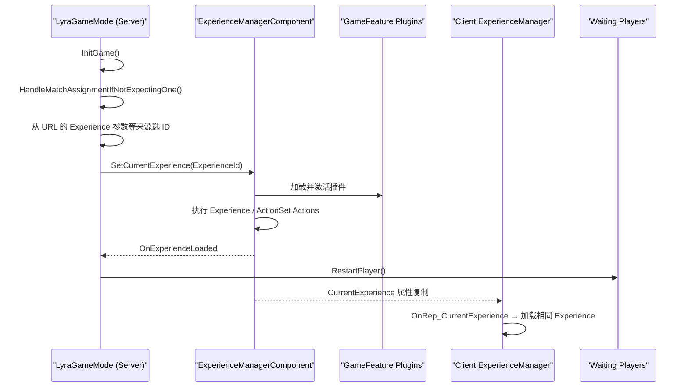
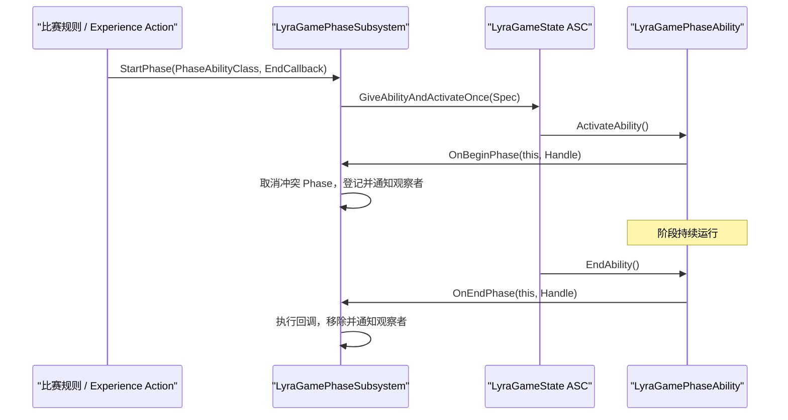
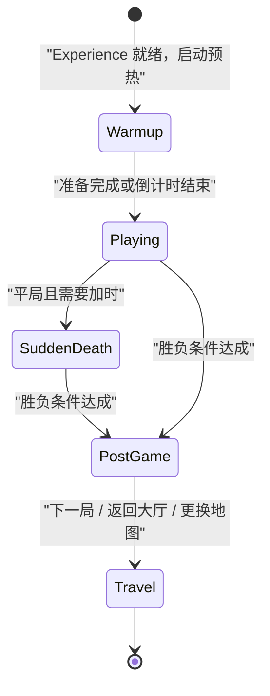

> [!abstract] 本文范围
> 本文梳理 Lyra 从菜单创建/查找/加入 Session，到服务器旅行、客户端跟随进入地图、加载 Experience，再到服务器驱动比赛 Phase 的主流程。本文讨论的是 Lyra 自带的 `CommonSession` 与 Game Phase 框架，不等同于某个具体项目蓝图已经实现的完整大厅 UI 或比赛规则。

相关笔记：[[Lyra Game流程]] · [[Lyra GAS]] · [[Lyra GameFeature]] · [[Lyra项目结构与模块逻辑]]



# 创建/加入房间

> [!important] 先区分两个 Experience
> - `ULyraUserFacingExperienceDefinition` 是**菜单与房间层**的配置：地图、显示模式名、最大人数、Online/LAN 支持，以及传给地图的 Experience ID。
> - `ULyraExperienceDefinition` 是**进入地图后的局内配置**：Pawn、GameFeature、ActionSet 和 Experience Actions。
>
> 前者生成 Session/Travel 请求，后者决定新地图中实际启用的玩法功能。两者名字相近，但职责不同。

## 关键对象

| 对象 | 职责 | 关键位置 |
|---|---|---|
| `ULyraUserFacingExperienceDefinition` | 将菜单选项转为 Host 请求，写入 `Experience=<ID>` | [LyraUserFacingExperienceDefinition.cpp:13](D:/MatrixTA/LyraRPGGameplayAbility/Source/LyraGame/GameModes/LyraUserFacingExperienceDefinition.cpp:13) |
| `UCommonSessionSubsystem` | 创建、搜索、加入 Session，解析地址并发起旅行 | [CommonSessionSubsystem.cpp:459](D:/MatrixTA/LyraRPGGameplayAbility/Plugins/CommonUser/Source/CommonUser/Private/CommonSessionSubsystem.cpp:459) |
| `ALyraGameMode` | 新地图加载后选择局内 Experience | [LyraGameMode.cpp:80](D:/MatrixTA/LyraRPGGameplayAbility/Source/LyraGame/GameModes/LyraGameMode.cpp:80) |
| `ULyraExperienceManagerComponent` | 设置、复制和加载 Experience，激活 GameFeature | [LyraExperienceManagerComponent.cpp:50](D:/MatrixTA/LyraRPGGameplayAbility/Source/LyraGame/GameModes/LyraExperienceManagerComponent.cpp:50) |

## 创建房间

### 1. UserFacingExperience 生成 Host 请求

`CreateHostingRequest()` 创建 `UCommonSession_HostSessionRequest`，主要填写：

- `MapID`：服务器要旅行到的地图。
- `ModeNameForAdvertisement`：Session 浏览器显示的模式名。
- `ExtraArgs`：额外 URL 参数。
- `Experience=<ExperienceID.PrimaryAssetName>`：新地图选择局内 Experience 的关键参数。
- `MaxPlayerCount`：房间最大人数。
- `OnlineMode`、`bUseLobbies`、`bUsePresence`：依据资产配置和运行方式决定。

入口：[LyraUserFacingExperienceDefinition.cpp:13](D:/MatrixTA/LyraRPGGameplayAbility/Source/LyraGame/GameModes/LyraUserFacingExperienceDefinition.cpp:13)

### 2. HostSession 创建 Session 并切图



执行顺序：

1. `HostSession()` 校验请求、世界和本地玩家。
2. `Offline` 不创建在线 Session，直接 `ServerTravel(Request->ConstructTravelURL())`。
3. `LAN/Online` 先创建 Session/Lobby，并暂存 `PendingTravelURL`。
4. `FinishSessionCreation(true)` 收到成功结果后执行 `ServerTravel(PendingTravelURL)`。

关键代码：

- Host 入口：[CommonSessionSubsystem.cpp:459](D:/MatrixTA/LyraRPGGameplayAbility/Plugins/CommonUser/Source/CommonUser/Private/CommonSessionSubsystem.cpp:459)
- Offline 直接旅行：[CommonSessionSubsystem.cpp:495](D:/MatrixTA/LyraRPGGameplayAbility/Plugins/CommonUser/Source/CommonUser/Private/CommonSessionSubsystem.cpp:495)
- 缓存 Travel URL：[CommonSessionSubsystem.cpp:509](D:/MatrixTA/LyraRPGGameplayAbility/Plugins/CommonUser/Source/CommonUser/Private/CommonSessionSubsystem.cpp:509)
- 创建成功后旅行：[CommonSessionSubsystem.cpp:693](D:/MatrixTA/LyraRPGGameplayAbility/Plugins/CommonUser/Source/CommonUser/Private/CommonSessionSubsystem.cpp:693)

### 3. ConstructTravelURL

`ConstructTravelURL()` 先由 `MapID` 解析地图包路径，再追加参数：

| 模式 | URL 行为 |
|---|---|
| Offline | 不追加 `listen`，本地进入地图 |
| LAN | 追加 `?bIsLanMatch` 与 `?listen` |
| Online | 追加 `?listen` |
| 全部模式 | 追加 `ExtraArgs`，通常包含 `Experience=<ID>` |

URL 形态类似：

```text
/Game/System/FrontEnd/Maps/L_Convolution_Blockout?listen?Experience=B_ShooterGame_Elimination
```

实际名称由数据资产决定。代码：[CommonSessionSubsystem.cpp:241](D:/MatrixTA/LyraRPGGameplayAbility/Plugins/CommonUser/Source/CommonUser/Private/CommonSessionSubsystem.cpp:241)、[CommonSessionSubsystem.cpp:254](D:/MatrixTA/LyraRPGGameplayAbility/Plugins/CommonUser/Source/CommonUser/Private/CommonSessionSubsystem.cpp:254)

> [!note] Session 状态不等于比赛 Phase
> `CommonSessionSubsystem` 管理房间存在、玩家连接和 Presence；Warmup、Playing、PostGame 等局内状态由 Game Phase 管理。不要把 `InGame` Presence 当成已经进入 `Playing` Phase。

## 查找并加入房间



### 搜索

`FindSessions()` 根据 Online Services 版本走不同实现：

- OSSv1：`IOnlineSession::FindSessions()`。
- OSSv2：`FindLobbies()`，再将结果包装成 `UCommonSession_SearchResult`。

入口：[CommonSessionSubsystem.cpp:756](D:/MatrixTA/LyraRPGGameplayAbility/Plugins/CommonUser/Source/CommonUser/Private/CommonSessionSubsystem.cpp:756)

### 加入并跟随切图

`JoinSession()` 校验本地玩家与搜索结果，读取房间广播信息，再交给 Online Subsystem 加入。成功后，`FinishJoinSession()` 调用 `InternalTravelToSession(NAME_GameSession)`；后者解析连接字符串，广播 `OnPreClientTravelEvent`，最后执行：

```cpp
PlayerController->ClientTravel(URL, TRAVEL_Absolute);
```

因此客户端不是自己重新选择地图，而是连接解析出的服务器地址并加载服务器当前地图。

关键代码：

- Join 入口：[CommonSessionSubsystem.cpp:1157](D:/MatrixTA/LyraRPGGameplayAbility/Plugins/CommonUser/Source/CommonUser/Private/CommonSessionSubsystem.cpp:1157)
- Join 完成处理：[CommonSessionSubsystem.cpp:1309](D:/MatrixTA/LyraRPGGameplayAbility/Plugins/CommonUser/Source/CommonUser/Private/CommonSessionSubsystem.cpp:1309)
- 解析地址：[CommonSessionSubsystem.cpp:1523](D:/MatrixTA/LyraRPGGameplayAbility/Plugins/CommonUser/Source/CommonUser/Private/CommonSessionSubsystem.cpp:1523)
- 最终 ClientTravel：[CommonSessionSubsystem.cpp:1583](D:/MatrixTA/LyraRPGGameplayAbility/Plugins/CommonUser/Source/CommonUser/Private/CommonSessionSubsystem.cpp:1583)

> [!warning] ServerTravel 与 ClientTravel 的职责不同
> 房主/服务器通过 `ServerTravel` 更换权威世界；未连接玩家通过 `ClientTravel` 加入。已连接客户端会由 UE 网络旅行机制协调迁移。是否启用无缝旅行及过渡地图，需要结合 GameMode 与项目配置确认。

## 进入地图后的 Experience 选择与同步



`ALyraGameMode` 在 `InitGame()` 的下一 Tick 选择 Experience。来源优先级包括匹配分配、URL 参数 `?Experience=`、PIE 设置、命令行、WorldSettings、专用服务器配置与默认值。Host 请求写入的 `Experience` 参数在这里读取。

服务器调用 `SetCurrentExperience()` 后，`CurrentExperience` 复制给客户端；两端分别加载资产、激活 GameFeature、执行 Experience/ActionSet Actions。服务器等待 Experience 就绪后再重生等待中的玩家。

关键代码：

- 延迟选择与来源优先级：[LyraGameMode.cpp:80](D:/MatrixTA/LyraRPGGameplayAbility/Source/LyraGame/GameModes/LyraGameMode.cpp:80)、[LyraGameMode.cpp:88](D:/MatrixTA/LyraRPGGameplayAbility/Source/LyraGame/GameModes/LyraGameMode.cpp:88)
- 设置 Experience：[LyraGameMode.cpp:289](D:/MatrixTA/LyraRPGGameplayAbility/Source/LyraGame/GameModes/LyraGameMode.cpp:289)
- 服务端开始加载：[LyraExperienceManagerComponent.cpp:56](D:/MatrixTA/LyraRPGGameplayAbility/Source/LyraGame/GameModes/LyraExperienceManagerComponent.cpp:56)
- 客户端复制回调：[LyraExperienceManagerComponent.cpp:118](D:/MatrixTA/LyraRPGGameplayAbility/Source/LyraGame/GameModes/LyraExperienceManagerComponent.cpp:118)
- 加载完成并激活 GameFeature：[LyraExperienceManagerComponent.cpp:214](D:/MatrixTA/LyraRPGGameplayAbility/Source/LyraGame/GameModes/LyraExperienceManagerComponent.cpp:214)

# 比赛流程

> [!important] Lyra 的局内状态机核心是 Game Phase
> Lyra 的比赛流程通常不只依赖传统 `GameMode::StartMatch()` / `EndMatch()`，而是由挂在 `GameState` AbilitySystemComponent 上的 `ULyraGamePhaseAbility` 表示 Warmup、Playing、PostGame 等阶段，再由 `ULyraGamePhaseSubsystem` 统一启动、互斥和监听。

相关GA位于/ShooterCore/Experiences/Phases/Phase_Playing，父类为ULyraGamePhaseAbility-> ULyraGameplayAbility，为服务器执行用GA逻辑:
- Phase_Warmup：预热阶段，主要添加玩家免伤以及Cosmetic的逻辑。
- Phase_Playing：开始游戏阶段，没有任何有效逻辑
- Phase_PostGame：游戏结束，免伤、禁止使用技能、ULyraSystemStatics::PlayNextGame()

## Phase 核心对象

| 对象 | 职责 |
|---|---|
| `ALyraGameState` 的 ASC | 保存并运行服务器授予的 Phase Gameplay Ability |
| `ULyraGamePhaseSubsystem` | 启动 Phase、记录活跃 Phase、按 Tag 层级取消冲突 Phase、通知观察者 |
| `ULyraGamePhaseAbility` | 具体阶段的能力基类；开始/结束时回调 Subsystem |
| `FGameplayTag` | 定义阶段层级，例如 `Game.Playing`、`Game.Playing.SuddenDeath` |

## 启动一个 Phase

入口：[LyraGamePhaseSubsystem.cpp:50](D:/MatrixTA/LyraRPGGameplayAbility/Source/LyraGame/AbilitySystem/Phases/LyraGamePhaseSubsystem.cpp:50)

`StartPhase()` 的顺序：

1. 从 World 获取 `ALyraGameState`。
2. 从 GameState 获取 `ULyraAbilitySystemComponent`。
3. 用 Phase Ability 类创建 `FGameplayAbilitySpec`。
4. 调用 `GiveAbilityAndActivateOnce()`，临时授予 GameState ASC 并立即激活。
5. 激活成功后，将结束回调存入 `ActivePhaseMap`；失败则立即回调。



## Phase Ability 的网络语义

构造函数：[LyraGamePhaseAbility.cpp:16](D:/MatrixTA/LyraRPGGameplayAbility/Source/LyraGame/AbilitySystem/Phases/LyraGamePhaseAbility.cpp:16)

| 配置 | 值 | 含义 |
|---|---|---|
| `ReplicationPolicy` | `ReplicateNo` | Ability 实例本身不复制 |
| `InstancingPolicy` | `InstancedPerActor` | 每个拥有者 Actor 使用独立实例 |
| `NetExecutionPolicy` | `ServerInitiated` | 由服务器发起执行 |
| `NetSecurityPolicy` | `ServerOnly` | 只允许服务器执行 |

`ActivateAbility()` 与 `EndAbility()` 都检查 `ActorInfo->IsNetAuthority()`，只有权威端才调用 `OnBeginPhase()` / `OnEndPhase()`。

> [!warning] 不要把 ActivePhaseMap 当作客户端复制状态
> Phase Ability 配置为 `ReplicateNo`，`ActivePhaseMap` 也是 Subsystem 的运行时记录。客户端 UI 若要显示倒计时、比分或阶段，应读取明确复制的 GameState/PlayerState 数据，或通过 Gameplay Message、Gameplay Cue、复制属性等机制获得表现事件；具体方式取决于 Phase 蓝图与 Experience Action。

## Phase Tag 的层级与互斥

`OnBeginPhase()` 的核心规则是：如果“新 Phase Tag 不匹配旧 Phase Tag”，旧 Phase 会被取消。GameplayTag 的父子匹配由此产生“父阶段可与子阶段共存、同级分支互斥”的效果。

实现：[LyraGamePhaseSubsystem.cpp:136](D:/MatrixTA/LyraRPGGameplayAbility/Source/LyraGame/AbilitySystem/Phases/LyraGamePhaseSubsystem.cpp:136)

| 已激活 Phase | 新 Phase | 结果 |
|---|---|---|
| `Game.Playing` | `Game.Playing.SuddenDeath` | 新 Tag 匹配父 Tag，二者可共存 |
| `Game.Playing.Normal` | `Game.Playing.SuddenDeath` | 同级分支不匹配，旧 Normal 被取消 |
| `Game.Playing` / `Game.Playing.*` | `Game.PostGame` | 新 Tag 不匹配 Playing 分支，Playing 相关 Phase 被取消 |

`IsPhaseActive(Tag)` 也使用 Tag 匹配，查询父 Tag 时能识别正在运行的子阶段。代码：[LyraGamePhaseSubsystem.cpp:122](D:/MatrixTA/LyraRPGGameplayAbility/Source/LyraGame/AbilitySystem/Phases/LyraGamePhaseSubsystem.cpp:122)

## Phase 开始与结束

- `ActivateAbility()` 在服务器调用 `OnBeginPhase()`：取得 `GamePhaseTag`，取消不兼容 Phase，登记新 Phase，通知 Start Observers。代码：[LyraGamePhaseAbility.cpp:25](D:/MatrixTA/LyraRPGGameplayAbility/Source/LyraGame/AbilitySystem/Phases/LyraGamePhaseAbility.cpp:25)、[LyraGamePhaseSubsystem.cpp:136](D:/MatrixTA/LyraRPGGameplayAbility/Source/LyraGame/AbilitySystem/Phases/LyraGamePhaseSubsystem.cpp:136)
- `EndAbility()` 在服务器调用 `OnEndPhase()`：执行结束回调，移除 Phase，通知 End Observers。代码：[LyraGamePhaseAbility.cpp:36](D:/MatrixTA/LyraRPGGameplayAbility/Source/LyraGame/AbilitySystem/Phases/LyraGamePhaseAbility.cpp:36)、[LyraGamePhaseSubsystem.cpp:193](D:/MatrixTA/LyraRPGGameplayAbility/Source/LyraGame/AbilitySystem/Phases/LyraGamePhaseSubsystem.cpp:193)

## 典型比赛阶段



项目中可见的典型 Phase 资产：

- `Plugins/GameFeatures/ShooterCore/Content/Experiences/Phases/Phase_Warmup.uasset`
- `Plugins/GameFeatures/ShooterCore/Content/Experiences/Phases/Phase_Playing.uasset`
- `Plugins/GameFeatures/ShooterCore/Content/Experiences/Phases/Phase_PostGame.uasset`

> [!caution] 蓝图证据边界
> `.uasset` 是二进制资产。C++ 可以确认 Phase 框架、网络权限和互斥机制，但“谁启动第一个 Phase、倒计时如何结束、何时切到 PostGame、何时计分和换图”等触发条件，仍需在 Unreal Editor 中检查 Phase 蓝图、Experience、GameFeature Action 和比赛规则蓝图。

## 比赛结束、Session 与换图的边界

- **比赛结束**：通常是服务器启动 `PostGame` Phase，停止/替换 Playing 分支并结算结果。
- **Session 仍可存在**：PostGame 不等于销毁 Session，玩家可留在同一房间等待下一局。
- **更换地图**：服务器规则决定何时再次 `ServerTravel`；已连接客户端由 UE 网络旅行机制协调迁移。
- **离开房间**：返回主菜单、Session 清理/销毁属于 Session 生命周期，不是 Phase 自身职责。

完整联机比赛要同时协调三层状态：

| 层级 | 典型状态 | 负责人 |
|---|---|---|
| Session | Creating / Pending / InGame / Destroying | `UCommonSessionSubsystem` + Online Subsystem |
| Experience | Unloaded / Loading / Loaded / Deactivating | `ULyraExperienceManagerComponent` |
| Match Phase | Warmup / Playing / SuddenDeath / PostGame | `ULyraGamePhaseSubsystem` + Phase Abilities |

## 源码索引

| 主题 | 文件 |
|---|---|
| UserFacingExperience 转 Host 请求 | [LyraUserFacingExperienceDefinition.cpp:13](D:/MatrixTA/LyraRPGGameplayAbility/Source/LyraGame/GameModes/LyraUserFacingExperienceDefinition.cpp:13) |
| Host、Find、Join、Travel | [CommonSessionSubsystem.cpp:459](D:/MatrixTA/LyraRPGGameplayAbility/Plugins/CommonUser/Source/CommonUser/Private/CommonSessionSubsystem.cpp:459) |
| 新地图选择 Experience | [LyraGameMode.cpp:80](D:/MatrixTA/LyraRPGGameplayAbility/Source/LyraGame/GameModes/LyraGameMode.cpp:80) |
| Experience 加载与复制 | [LyraExperienceManagerComponent.cpp:50](D:/MatrixTA/LyraRPGGameplayAbility/Source/LyraGame/GameModes/LyraExperienceManagerComponent.cpp:50) |
| 启动、互斥、查询和结束 Phase | [LyraGamePhaseSubsystem.cpp:50](D:/MatrixTA/LyraRPGGameplayAbility/Source/LyraGame/AbilitySystem/Phases/LyraGamePhaseSubsystem.cpp:50) |
| Phase Ability 权威端生命周期 | [LyraGamePhaseAbility.cpp:16](D:/MatrixTA/LyraRPGGameplayAbility/Source/LyraGame/AbilitySystem/Phases/LyraGamePhaseAbility.cpp:16) |
